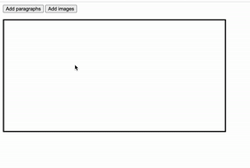

# Instructions

**Download this repository!**

1. Read over the index.html and style.css files to understand how they are organized.
2. Using only the script.js, your job is write code that will add images within the img_Div whenever the "add images" button is pressed. Similarly, write code that will add paragraphs within the p_Div whenever the "add paragraphs" button is pressed. Only one div (either the p_Div or the img_Div will be visible at all times). You are not allowed to change the index.html or the style.css. 
3. Within the script.js, define 4 variables for each element we are working with (2 buttons and 2 div containers). Assign the variables to the reference of the #p_button, #img_button, #p_div, and #img_div. 
    * Hint: how do we select for elements with an id using the DOM ???
4. Hmm right now our webpage has two boxes visible. Let's hide the image div container using the display property. 
5. Much better. Now let's work on adding all of the functionality for when the image button is clicked.
6. Define a function called onClick_i to serve as the callback function. 
7. Within the function onClick_i:
    * Hide the paragraph div using the display property
    * Lets change the css of our img div container to display block
    * Create a new img element using the createElement() function;
    * Set the source of the new image to "images/pikachu.png"
    * Change the width of our new image to 150 px;
    * Append the new image element to our image div container
8. Outside of your function, add an event listener to your image button so that your callback function is executed when the button is clicked.

## The Next Step (Get the images button working first!)
Similar to what we just did for the images button, write code to add new paragraphs in the p div container whenever the "add paragraphs" button is clicked. Each new paragraph that is added should have:
* the string "Hot chocolate is bad today"
* a background color of black
* a text color of white
* a padding of 10 px
